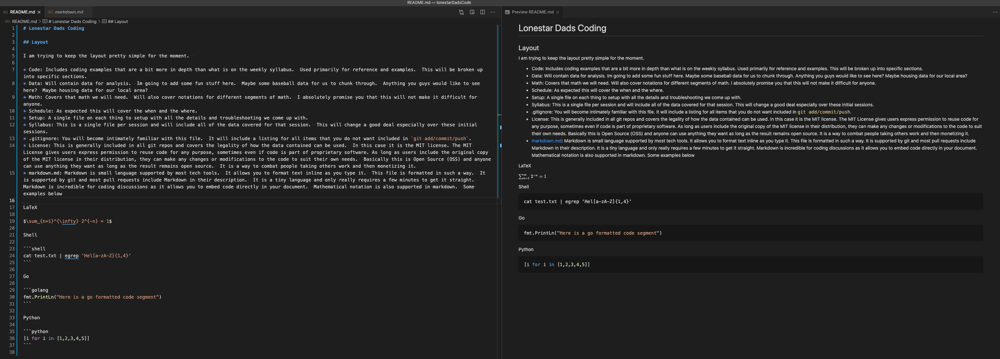

# Lonestar Dads Coding

## Layout

I am trying to keep the layout pretty simple for the moment.  

* Setup: A single file on each thing to setup with all the details and troubleshooting we come up with.  In preparation, I would like everyone to setup the following.  Details along with troubleshooting will be in the documents under setup/:
    * Git account and Git on your local machine.
    * Python 3.9x
    * VSCode
    * leetcode.com account
    * virtualEnv
    * jupyter and jupyter-extensions
* Code: Includes coding examples that are a bit more in depth than what is on the weekly syllabus.  Used primarily for reference and examples.  This will be broken up into specific sections.  This is where most of the fun stuff will be.
    * Shell: Some things are just easier with the shell.  Will spend as little time as possible here but the `cat -> grep -> tr -> cut -> sort -> uniq` loop will save you hours.  For instance, for the baseball data some headers came in a weird format.  This converted them to a csv heading in well under a second.  Would have take a half hour to do by hand.  `cat _ | egrep -v 'sort|text_format|grid_|^$' | tr '\n' ','`
    * Python Base: Covers the base language.  The first few classes with be specific on this.  Then we can start roaming around to usage of the language in more fun ways.
    * Data Structures and Algorithms:  Data structures are the means by which we store data.  Algorithms are the way we operate on that data.
    * Games: Ever wanted to make a game.  This is how to do it.  Your kids will be in awe!
    * Gui: Graphical User Interface.  This is a way to click around your program.
    * Machine Learning: Let the machine do the work for you.  Give it a picture and let it tell you if that is a cookie or a dog (harder than you might think).  This is currently all the rage.
    * Statistical Modeling: Did your father-in-law just say something that made you go "what?!?".  This is where you prove him wrong.
    * Plotting and Graphing: Take that proof and plot it out.  Show your father-in-law or wife not just that they are wrong, but how wrong they are!
    * REST-full Api's: Use other people's work.  Want to predicts stocks, beat the weather, pick the best fishing spot?  Here it is!
    * Web Scraping: This covers methods of using a program to analyze a site and collect the data that exists there.  Pairs well with all forms of analysis and making a profit.  There are many ways to make money from simply making data from sites available in an API.
    * Databases: It may be dull, we but we have to have a data layer.
    * Regular Expressions: A very advanced way to parse text.  Very difficult to read as a human.  Often referred to as a write-only language as you pretty much create a new expression every time you use it.
    * IOT: Another big one right now.  Create your own devices using python, a controller and suite of sensors.  React to temp, voltage, movement, anything you would like.
* Data: Will contain data for analysis.  Im going to add some fun stuff here.  Maybe some baseball data for us to chunk through.  Anything you guys would like to see here?  Maybe housing data for our local area?
    * dataPrep: This is where I slice the data up for consumption.  Github is not really fond of very large files.  This is filtered out in the .gitignore file.
    * baseball/teams.csv: Team data since 2000.
    * baseball/cubsHittersSince2000.csv: I'm biassed.  Sue me.
* Infrastructure: Will cover means for hosting and executing code.
* Math: Covers that math we will need.  Will also cover notations for different segments of math.  I absolutely promise you that this will not make it difficult for anyone.
* Schedule: As expected this will cover the when and the where.
* Syllabus: This is a single file per session and will include all of the data covered for that session.  This will change a good deal especially over these initial sessions.
* .gitignore: You will become intimately familiar with this file.  It will include a listing for all items that you do not want included in `git add/commit/push`.
* License: This is generally included in all git repos and covers the legality of how the data contained can be used.  In this case it is the MIT license. The MIT License gives users express permission to reuse code for any purpose, sometimes even if code is part of proprietary software. As long as users include the original copy of the MIT license in their distribution, they can make any changes or modifications to the code to suit their own needs.  Basically this is Open Source (OSS) and anyone can use anything they want as long as the result remains open source.  It is a way to combat people taking others work and then monetizing it.
* markdown.md: Markdown is small language supported by most tech tools.  It allows you to format text inline as you type it.  This file is formatted in such a way.  It is supported by git and most pull requests include Markdown in their description.  It is a tiny language and only really requires a few minutes to get it straight.  Markdown is incredible for coding discussions as it allows you to embed code directly in your document.  Mathematical notation is also supported in markdown.  Some examples below
* media.md: What and who I follow that gives me value.

LaTeX (Currently github does not render LaTeX)

$\sum_{n=1}^{\infty} 2^{-n} = 1$

Shell

```shell
cat test.txt | egrep 'Hel[a-zA-Z]{1,4}'
```

Go

```golang
fmt.PrintLn("Here is a go formatted code segment")
```

Python

```python
[i for i in [1,2,3,4,5]]
```

Image of markdown and resulting document.  The markdown is on the left and resulting parsed document is on the right.

